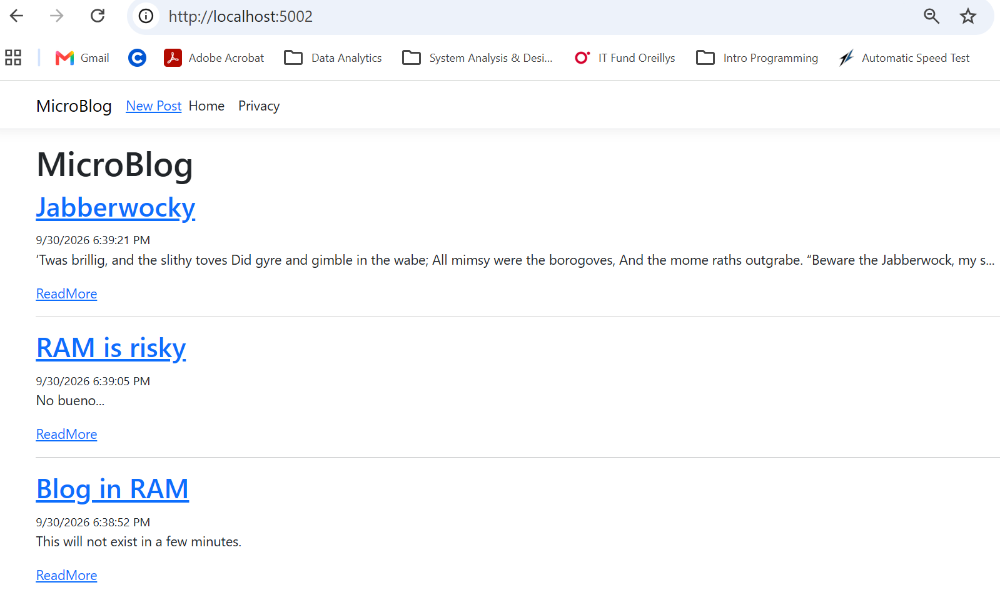
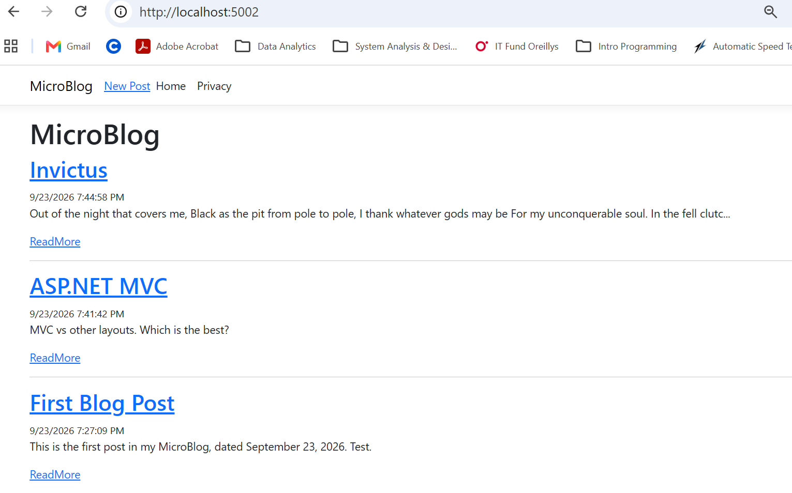
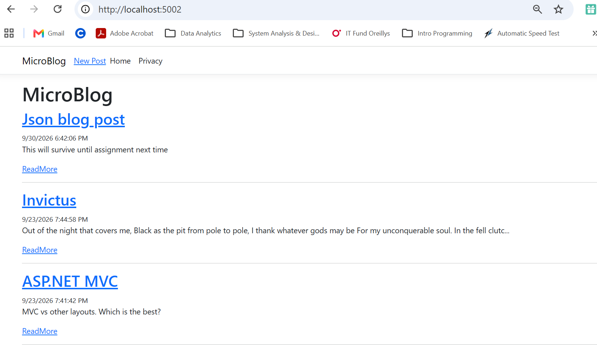
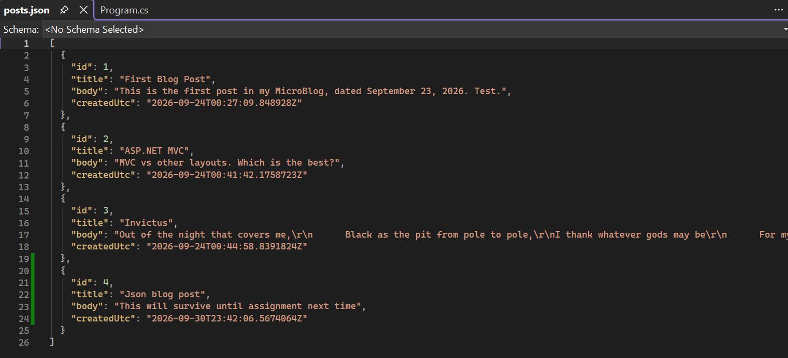

# BlogRepository

## Project Description

ASP.NET course Razor Pages application showing the repository changes and dependency injection. You can use either an in-memory RAM repo or a JSON repo. JSON persists after application is stopped.

## Switching Repositories

The repository is configured through dependency injection in Program.cs. Instructions to switch between the two are as follows:

To use RAM repo enable (and comment out JSON line below): `builder.Services.AddSingleton<IBlogRepository, InMemoryBlogRepository>();`

To use the JSON repo enable (and comment out RAM line above): `builder.Services.AddSingleton<IBlogRepository, JsonBlogRepository>();`

## Screenshots

### RAM In-Memory Repo

### Posts in JSON Repo before new post created

### New Post to JSON Repo

### JSON Repository - Persisted Data

